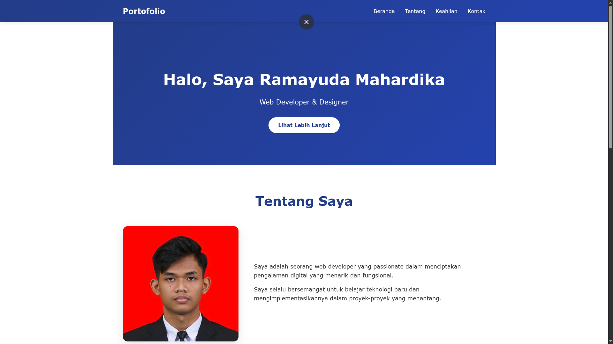

# Tugas Akhir Praktikum Pemrograman Web

Nama: Ramayuda Mahardika

NPM: 2315061126

Kelas: PW B

## Deskripsi Proyek

Proyek ini adalah portofolio sederhana yang dibuat untuk tugas akhir praktikum Pemrograman Web. Situs statis ini menampilkan informasi singkat tentang penulis (profil), keahlian, dan kontak. Struktur proyek ringan dan cocok untuk dihosting sebagai halaman statis.

Konten utama:

- `index.html` — halaman utama situs
- `style.css` — styling untuk tampilan
- `image/` — folder gambar (ikon, preview, dan screenshot)

## Struktur direktori (ringkas)

```
index.html
style.css
README.md
image/
  ├─ preview.png
  ├─ ss.png
  ├─ html_css.png
  ├─ javascript.png
  ├─ react.png
  └─ figma.png
```

## Prasyarat

- Web browser modern (Chrome, Firefox, Edge, dsb.)
- (Opsional) Python 3 jika ingin menjalankan server lokal sederhana

## Langkah instalasi & penggunaan

1. Clone atau salin folder proyek ke mesin lokal Anda.

2. Cara cepat membuka (tanpa server):

   - Buka file `index.html` langsung di browser (klik dua kali atau buka melalui menu File -> Open).

3. Cara menjalankan dengan server lokal (direkomendasikan untuk menghindari masalah CORS saat memuat asset):

   - Jika Anda memiliki Python 3 terpasang, jalankan perintah berikut dari direktori proyek:

     python -m http.server 8000

   - Kemudian buka http://localhost:8000 di browser Anda.

4. Mengedit konten:

   - Sunting `index.html` untuk mengubah teks, gambar, atau tautan.
   - Sunting `style.css` untuk mengubah tampilan.

## Menampilkan preview tampilan (TA 1)

judul: preview tampilan 



## Menampilkan screenshot Git log (TA 2)

Judul: git log --graph --oneline


Gambar di atas (`image/ss.png`) adalah screenshot yang menunjukkan output perintah git log dengan opsi `--graph --oneline`. Simpan screenshot tersebut di folder `image/` agar tampil di README.

## Penulis

Ramayuda Mahardika — `ramayudaid@gmail.com`

## Lisensi

Gunakan sesuai kebutuhan; ini hanya contoh tugas praktikum.
